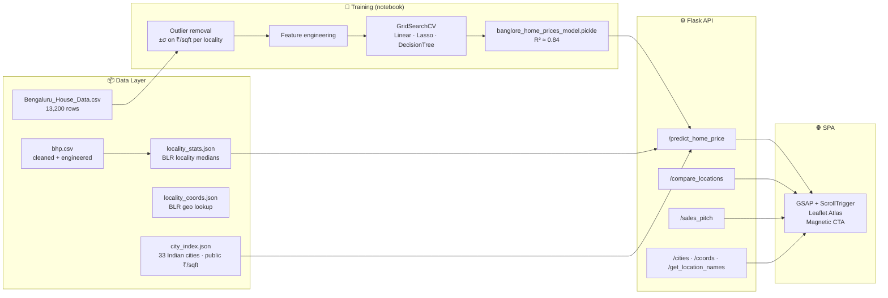

# 🏛️ Prophecy India — Property Intelligence Engine

> *Stop predicting. Start understanding.*

[](https://www.python.org/)
[](https://flask.palletsprojects.com/)
[](https://scikit-learn.org/)
[](https://greensock.com/gsap/)
[](https://leafletjs.com/)
[](#-run-with-docker)

A transparent ML engine that explains the **why** behind the **how much** — built on 13,200 Bangalore datapoints and extended to **33+ Indian cities** through public housing benchmarks.

---

## ⚡ Why This Stands Out

Most real-estate predictors are black boxes. Prophecy is **two engines in one**, each transparent about its method:

| Mode | When | How it works |
|---|---|---|
| 🧠 `ml-localized` | Bangalore + locality | Full LinearRegression model with 240 one-hot localities (R² 0.84). Per-feature contributions extracted directly from coefficients. |
| 🌏 `city-index`   | Any of 33 Indian cities | Public median ₹/sqft benchmarks × area + BHK/bath adjustment factors + sentiment multiplier. Honest, free, reproducible. |

Both paths return **the same shape of response**: price + ranked explanation + investment score + coords.

| Capability | Description |
|---|---|
| 🧠 **Explainable Predictions** | Exact per-feature contributions in ₹ Lakh — no opaque "black box". |
| 📈 **Investment Score (0–10)** | Predicted ₹/sqft benchmarked against locality (BLR) or city (rest of India). |
| ⚖️ **Comparison Engine** | Mumbai vs. Whitefield in one click — diff, %, and "better value per sqft". |
| 🐂 **Sentiment Toggle** | Bullish / Neutral / Bearish multiplier reflects current market regime. |
| 🗺️ **Atlas of India** | Leaflet map with 33 pulse-pinned cities + 100+ Bangalore localities. Click → load. |
| ✨ **AI Sales Pitch** | Deterministic, offline template by default. Optional `OPENAI_API_KEY` swap. |
| 🐳 **Production Ready** | `Dockerfile`, gunicorn entrypoint, CORS-enabled API. |

---

## 🎨 The Redesign

The UI was rebuilt from scratch around a single thesis: **"Architectural Blueprint × Property Intelligence."**

| Decision | Why |
|---|---|
| **Color: midnight navy + terracotta + paper cream** | Feels like a blueprint at night. Anti-cliché for "tech blue" or "prop-tech green". The terracotta references Indian brass/copper aesthetics without leaning kitsch. |
| **Type: Fraunces (display) + Inter Tight (body) + JetBrains Mono (data)** | Fraunces is an editorial variable serif — feels like a real-estate magazine, not an AI startup. Inter Tight has personality without going Inter-default. |
| **Layout: asymmetric, no card grids** | The "three-column-icon-title-paragraph" layout is the dead giveaway of an AI-generated landing page. Every section here has its own micro-theme. |
| **Background: faint blueprint grid + subtle noise** | Looks intentional, not generated. The blueprint pattern reinforces the architectural metaphor. |
| **Animations: GSAP + ScrollTrigger** | Word-by-word hero reveal, blueprint draw-on, scroll-linked counters, magnetic CTA — the page choreographs itself. |

### Animation principles applied

- **Easing**: `cubic-bezier(0.23, 1, 0.32, 1)` for entrances, `cubic-bezier(0.4, 0, 0.2, 1)` for state changes, `elastic.out(1, 0.5)` for the magnetic CTA snap-back.
- **Stagger**: 70ms between hero words, 80ms between pipeline steps, 70ms between explainability bars.
- **Duration ladder**: 180ms hover, 600–900ms reveal, 1.0s hero word reveal, 1.6s counter count-up.
- **Hardware-accelerated**: every animation targets `transform` or `opacity` only.
- **`prefers-reduced-motion`**: respected — page renders fully, no motion.

---

## 🏗️ System Architecture



---

## 📈 Model Performance

| Metric | Value |
|---|---|
| Bangalore algorithm | **LinearRegression** (selected via `GridSearchCV` over Linear / Lasso / DecisionTree) |
| Bangalore R² | **0.84** |
| Bangalore features | 243 (sqft, bath, BHK + 240 one-hot localities) |
| Bangalore training rows | ~10,500 (after outlier removal) |
| Pan-India coverage | 33 cities (Tier 1 + Tier 2 + select Tier 3) |
| City-index source | Public NHB Residex + aggregated listings (2024) |

---

## 🚀 Quick Start

```bash
git clone https://github.com/Vaishnavi-Dubey/price_prediction.git
cd price_prediction
pip install -r requirements.txt
python server.py
# → http://127.0.0.1:5000
```

### 🐳 Run with Docker

```bash
docker build -t prophecy-india .
docker run -p 5000:5000 prophecy-india
```

### ✨ Optional LLM pitch

```bash
export OPENAI_API_KEY="sk-..."
python server.py
```

Without the key, `/sales_pitch` falls back to a deterministic template — **zero external dependencies required**.

---

## 🔌 API Reference

| Method | Endpoint | Body | Returns |
|---|---|---|---|
| `GET`  | `/get_location_names` | — | Bangalore localities |
| `GET`  | `/cities`             | — | 33 Indian cities + benchmarks |
| `GET`  | `/coords`             | — | BLR locality lat/lng |
| `POST` | `/predict_home_price` | `city, location?, total_sqft, bhk, bath, sentiment` | price + explanation + investment |
| `POST` | `/compare_locations`  | `city_a, location_a?, city_b, location_b?, total_sqft, bhk, bath, sentiment` | side-by-side |
| `POST` | `/sales_pitch`        | `city, location?, total_sqft, bhk, bath, sentiment` | one-paragraph pitch |

### Sample — `POST /predict_home_price`

**Bangalore + locality** (full ML model):
```json
{
  "city": "Bangalore",
  "location": "Whitefield",
  "estimated_price": 69.75,
  "mode": "ml-localized",
  "explanation": [
    { "feature": "Area: 1200 sqft",       "contribution_lakh":  96.14 },
    { "feature": "Locality: Whitefield",  "contribution_lakh": -27.69 },
    { "feature": "2 bathroom(s)",         "contribution_lakh":   7.43 },
    { "feature": "2 BHK",                 "contribution_lakh":  -3.00 }
  ],
  "investment": { "score": 4.4, "verdict": "Overpriced", "benchmark_source": "locality" }
}
```

**Mumbai** (city-index):
```json
{
  "city": "Mumbai",
  "estimated_price": 300.0,
  "mode": "city-index",
  "explanation": [
    { "feature": "Base · Mumbai median (₹25,000/sqft × 1200 sqft)", "contribution_lakh": 300.0 }
  ],
  "investment": { "score": 5.0, "verdict": "Hold", "benchmark_source": "Mumbai median" }
}
```

---

## 📁 Project Layout

```
price_prediction/
├── server.py                          # Flask API + static SPA host
├── wsgi.py                            # gunicorn entrypoint
├── util.py                            # 2-mode inference, XAI, scoring, pitch
├── app.html / app.css / app.js        # Redesigned SPA (GSAP + Leaflet)
├── city_index.json                    # 33 Indian cities · public benchmarks
├── locality_stats.json                # BLR locality medians (from data)
├── locality_coords.json               # 100+ BLR localities geo
├── columns.json                       # model feature ordering
├── banglore_home_prices_model.pickle  # trained sklearn model
├── price-prediction.ipynb             # training + EDA notebook
├── bhp.csv                            # cleaned dataset
├── Bengaluru_House_Data.csv.xls       # raw dataset
├── requirements.txt
├── Dockerfile
└── README.md
```

---

## 🗺️ Roadmap

- [ ] Train a multi-city model when free, structured pan-India listings open up
- [ ] Per-locality time-series forecast for top 5 cities
- [ ] LightGBM/CatBoost for non-linear gains
- [ ] User accounts + saved-search portfolio

---

## 🙌 Credits

Built by **[Vaishnavi Dubey](https://github.com/Vaishnavi-Dubey)**.
Bangalore dataset: [Bengaluru House Price Data (Kaggle)](https://www.kaggle.com/datasets/amitabhajoy/bengaluru-house-price-data).
City benchmarks: aggregated public NHB Residex + listing medians (2024).

> The numbers behind the engine — and the engine behind the numbers.
