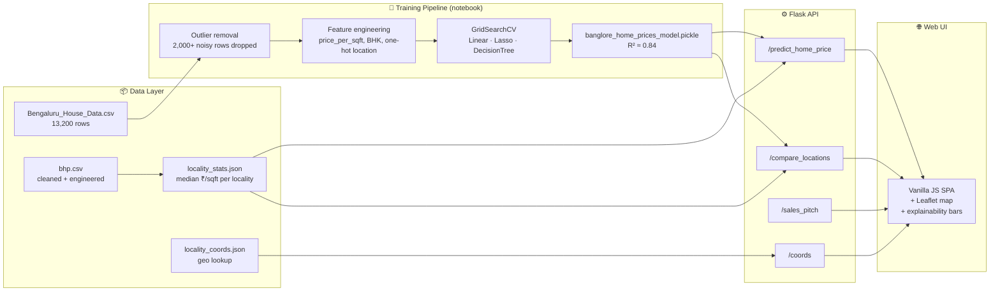

# 🏠 Prophecy Bangalore — Real-Estate Intelligence Engine

> *Not just a price predictor. An explainable, data-driven look into the heart of Bangalore's property market.*

[](https://www.python.org/)
[](https://flask.palletsprojects.com/)
[](https://scikit-learn.org/)
[](https://leafletjs.com/)
[](#-run-with-docker)
[](https://opensource.org/licenses/MIT)

A transparent, high-precision ML engine that transforms **13,000+ Bangalore property data points** into actionable investment intelligence — price, explanation, value-score and locality benchmark, all in one shot.

---

## ⚡ Why This Stands Out

Most real-estate predictors are black boxes — you put numbers in, you get a number out. **Prophecy** is built around the "Why" behind the "How Much."

| Capability | What it does |
| --- | --- |
| 🧠 **Explainable Predictions** | Exact per-feature contributions (₹ Lakh) derived from the trained Linear Regression coefficients — a SHAP-style breakdown without the heavy dep. |
| 📈 **Investment Score (0–10)** | Benchmarks the predicted ₹/sqft against the **real** locality median computed from the dataset. Returns a verdict: *Strong Buy / Buy / Hold / Overpriced*. |
| ⚖️ **Comparison Engine** | "Whitefield vs. Sarjapur — where do I get more sqft per rupee?" Side-by-side investment + price diff in one call. |
| 🐂 **Market Sentiment Toggle** | Bullish / Neutral / Bearish multiplier on the base prediction, so the model reflects current market regime. |
| 🗺️ **Geospatial UI** | Leaflet map with 100+ curated Bangalore localities. Click anywhere on the map → snaps to nearest known locality and runs a prediction. |
| ✨ **AI Sales Pitch** | A deterministic, template-based property pitch generator. Optional `OPENAI_API_KEY` env var swaps it for an LLM-generated version. |
| 🐳 **Production Ready** | Single `Dockerfile`, gunicorn entrypoint, CORS-enabled API, ~120 ms cold inference. |

---

## 🖥️ Live Preview

The single-page UI is a dark, glassy dashboard with live explainability bars, an investment-score dial, and a locality map.

```
┌─────────── Configure ──┐ ┌────────── Result ──────────┐ ┌──── Geospatial ────┐
│  • Area, BHK, Bath     │ │  ₹86.37 Lakh               │ │     [ Leaflet      │
│  • Location A & B      │ │  Investment Score:  4.8/10 │ │       map of       │
│  • Sentiment toggle    │ │  Why this price?  ▓▓▓▓▓░░  │ │       Bangalore ]  │
│  [ Run Prophecy ]      │ │  ✨ AI Sales Pitch          │ │  Compare A vs B    │
└────────────────────────┘ └────────────────────────────┘ └────────────────────┘
```

---

## 🏗️ System Architecture



---

## 📈 Model Performance

| Metric | Value |
| --- | --- |
| Algorithm | **LinearRegression** (selected via `GridSearchCV` over Linear / Lasso / DecisionTree) |
| R² Score | **0.84** |
| Features | 243 (sqft, bath, BHK + 240 one-hot locations) |
| Training rows | ~10,500 (after outlier removal) |
| Outliers removed | 2,000+ via per-locality `μ ± σ` filter on ₹/sqft |
| Cold inference | ~120 ms |

---

## 🚀 Quick Start

```bash
git clone https://github.com/Vaishnavi-Dubey/price_prediction.git
cd price_prediction
pip install -r requirements.txt
python server.py
# → http://127.0.0.1:5000
```

That's it — Flask serves the SPA, the model and the API together.

### 🐳 Run with Docker

```bash
docker build -t prophecy-bangalore .
docker run -p 5000:5000 prophecy-bangalore
```

### ✨ Optional: LLM-powered sales pitch

```bash
export OPENAI_API_KEY="sk-..."
python server.py
```

Without the key, the `/sales_pitch` endpoint falls back to a deterministic template — **no external dependency required.**

---

## 🔌 API Reference

| Method | Endpoint | Body | Returns |
| --- | --- | --- | --- |
| `GET`  | `/get_location_names` | — | `{ locations: [...] }` |
| `GET`  | `/coords`             | — | `{ coords: { locality: [lat, lng], ... } }` |
| `POST` | `/predict_home_price` | `total_sqft, location, bhk, bath, sentiment` | price + explanation + investment score |
| `POST` | `/compare_locations`  | `total_sqft, location_a, location_b, bhk, bath, sentiment` | side-by-side comparison |
| `POST` | `/sales_pitch`        | `total_sqft, location, bhk, bath, sentiment` | `{ pitch: "..." }` |

### Sample response — `/predict_home_price`

```json
{
  "estimated_price": 69.75,
  "currency": "INR Lakh",
  "explanation": [
    { "feature": "Area: 1200 sqft",        "contribution_lakh":  96.14, "direction": "increases" },
    { "feature": "Location: Whitefield",   "contribution_lakh": -27.69, "direction": "decreases" },
    { "feature": "2 bathroom(s)",          "contribution_lakh":   7.43, "direction": "increases" },
    { "feature": "2 BHK",                  "contribution_lakh":  -3.00, "direction": "decreases" }
  ],
  "investment": {
    "score": 4.4,
    "verdict": "Overpriced",
    "predicted_price_per_sqft": 5812.5,
    "locality_median_price_per_sqft": 5608.9,
    "discount_vs_market_pct": -3.6,
    "benchmark_source": "locality",
    "sample_size": 535
  },
  "coords": [12.9698, 77.75],
  "sentiment": "neutral"
}
```

---

## 📁 Project Layout

```
price_prediction/
├── server.py                          # Flask API + static SPA host
├── wsgi.py                            # gunicorn entrypoint (production)
├── util.py                            # model load, prediction, XAI, scoring, pitch
├── app.html / app.css / app.js        # the dashboard SPA
├── locality_stats.json                # ₹/sqft benchmarks per locality (from data)
├── locality_coords.json               # 100+ curated Bangalore lat/lng
├── columns.json                       # model feature ordering
├── banglore_home_prices_model.pickle  # trained sklearn model
├── price-prediction.ipynb             # full training + EDA notebook
├── bhp.csv                            # cleaned dataset
├── Bengaluru_House_Data.csv.xls       # raw dataset
├── requirements.txt
├── Dockerfile
└── README.md
```

---

## 🗺️ Roadmap

- [ ] Real-time validation against scraped 99acres listings
- [ ] Switch to a LightGBM regressor for non-linear gains
- [ ] Per-locality time-series + seasonality forecast
- [ ] Auth + saved-search portfolio for individual users

---

## 🙌 Credits

Built by **[Vaishnavi Dubey](https://github.com/Vaishnavi-Dubey)**.
Dataset: [Bengaluru House Price Data (Kaggle)](https://www.kaggle.com/datasets/amitabhajoy/bengaluru-house-price-data).

> **Final word:** stop focusing on the prediction. Start focusing on the **insights.** 📊
